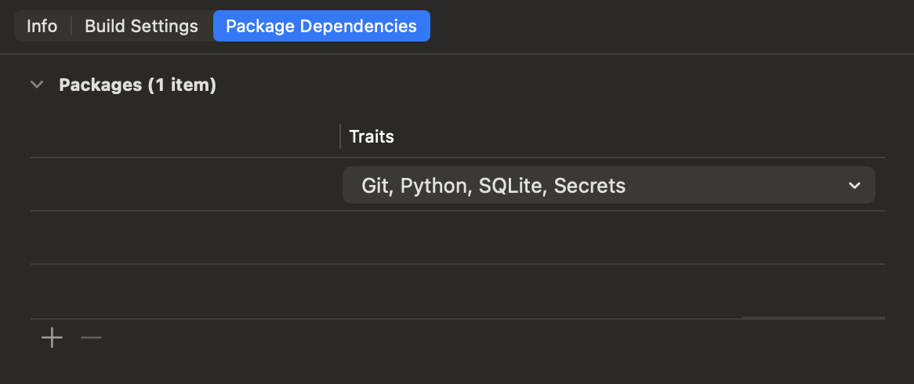

# Bash.swift

`Bash.swift` is an in-process, stateful shell for Swift apps. It is inspired by [just-bash](https://github.com/vercel-labs/just-bash). Commands run inside Swift instead of spawning host shell processes.

You create a `BashSession`, run shell command strings, and get structured `stdout`, `stderr`, and `exitCode` results back. Session state persists across runs, including the working directory, environment, history, and registered built-ins.

`Bash.swift` should be treated as beta software. It is practical for app and agent workflows, but it is not a hardened isolation boundary and it is not a drop-in replacement for a real system shell. APIs are being actively experimented with and deployed. Ensure you lock to a specific commit or version tag if you plan to do any work utilizing this library.

## Why

`Bash.swift` is built for app and agent workflows that need shell-like behavior without subprocess management.

It provides:
- Stateful shell sessions (`cd`, `export`, `history`, shell functions)
- Real filesystem side effects under a controlled root
- In-process built-in commands implemented in Swift
- Practical shell syntax support for pipelines, redirection, chaining, background jobs, and simple scripting

## Installation

### SwiftPM integration

Add `Bash` to your `Package.swift`:

```swift
// Package.swift
.dependencies: [
    .package(url: "https://github.com/velos/Bash.swift.git", from: "0.1.0")
],
.targets: [
    .target(
        name: "YourTarget",
        dependencies: ["Bash"]
    )
]
```

Traits are the way to compile optional toolsets into the package. Traits are default-off in `Bash.swift`, so add them on the package dependency when you need optional command sets:

```swift
.dependencies: [
    .package(
        url: "https://github.com/velos/Bash.swift.git",
        from: "0.1.0",
        traits: ["Git", "Python", "SQLite", "Secrets"]
    )
]
```

### Xcode integration

Use Xcode 26.4 or newer if you want to configure package traits from the Xcode UI.

1. Open your app or package project in Xcode.
2. Select the project in the navigator, then open the `Package Dependencies` tab.
3. Add `https://github.com/velos/Bash.swift.git`.
4. Select the `Bash.swift` package dependency and choose the traits you want enabled.



The traits shown in Xcode map directly to the SwiftPM traits in `Package.swift`. Enable only the features you need:
- `Git`
- `Python`
- `SQLite`
- `Secrets`

Notes:
- `Bash.swift` depends on the [`Workspace`](https://github.com/velos/Workspace) package for the reusable filesystem layer.
- `Bash` reexports the Workspace filesystem types, `BashCore`, `BashTools`, and any trait-enabled feature APIs, so downstream code only needs `import Bash`.
- The `Python` trait uses a prebuilt `CPython.xcframework` binary target.
- The `Git` trait uses a prebuilt `Clibgit2.xcframework` binary target.

### Example app

The repo includes [`Example/BashExample.xcodeproj`](Example/BashExample.xcodeproj), a small SwiftUI demo wired to the local `Bash` package.

The project ships with automatic signing, no development team, and a placeholder bundle identifier (`com.example.BashExample`). Open the **BashExample** target → **Signing & Capabilities** and pick your own **Team** before running on a device. The simulator runs as-is. Treat any signing or bundle ID changes as local-only — they do not need to be committed.

Supported package platforms:
- macOS 13+
- Mac Catalyst 16+
- iOS 16+
- tvOS 16+
- watchOS 9+

## Quick Start

```swift
import Bash
import Foundation

let root = URL(fileURLWithPath: "/tmp/bash-session", isDirectory: true)
let session = try await BashSession(rootDirectory: root)

_ = await session.run("touch file.txt")
let ls = await session.run("ls")
print(ls.stdoutString) // file.txt

let piped = await session.run("echo hello | tee out.txt > copy.txt")
print(piped.exitCode) // 0
```

For isolated per-run overrides without mutating the session's persisted shell state:

```swift
let scoped = await session.run(
    "pwd && echo $MODE",
    options: RunOptions(
        environment: ["MODE": "preview"],
        currentDirectory: "/tmp"
    )
)
```

## Optional Tool Traits

`Git`, `Python`, and `SQLite` are compiled in via traits and auto-register when `BashSession` starts. `Secrets` is also compiled in via a trait, but it stays disabled until you explicitly provide a secrets provider at runtime.

With `traits: ["Git", "Python", "SQLite"]` on the package dependency:

```swift
import Bash

let session = try await BashSession(rootDirectory: root)

_ = await session.run("git init")
let sql = await session.run("sqlite3 :memory: \"select 1;\"")
let py = await session.run("python3 -c \"print('hi')\"")

print(sql.stdoutString) // 1
print(py.stdoutString)  // hi
```

The `Python` trait embeds CPython directly. The package links the CPython binary target on macOS and iOS-family builds, including Mac Catalyst when the release artifact contains that slice. tvOS and watchOS still compile but report CPython as unavailable at runtime. Filesystem access stays inside the shell's configured `FileSystem`, and escape APIs such as `subprocess`, `ctypes`, and `os.system` are intentionally blocked. Maintainer notes for the self-contained Apple runtime artifact live in [docs/cpython-apple-runtime.md](docs/cpython-apple-runtime.md).

With `traits: ["Secrets"]` on the package dependency:

```swift
import Bash

let session = try await BashSession(rootDirectory: root)
let provider = AppleKeychainSecretsProvider()

await session.enableSecrets(provider: provider)

let ref = await session.run(
    "secrets put --service app --account api",
    stdin: Data("token".utf8)
)
```

The `Secrets` trait uses provider-owned opaque `secretref:...` references. `secrets get --reveal` is explicit, and `.resolveAndRedact` or `.strict` policies keep plaintext out of caller-visible output by default.

## Workspace Package

`Bash` sits on top of a reusable `Workspace` package. If you only need filesystem and workspace tooling, use `Workspace` directly instead of `BashSession`.

Example:

```swift
import Workspace

let filesystem = PermissionedFileSystem(
    base: try OverlayFilesystem(rootDirectory: workspaceRoot),
    authorizer: PermissionAuthorizer { request in
        switch request.operation {
        case .readFile, .listDirectory, .stat:
            return .allowForSession
        default:
            return .deny(message: "write access denied")
        }
    }
)

let workspace = Workspace(filesystem: filesystem)
let tree = try await workspace.summarizeTree("/workspace", maxDepth: 2)
```

`BashSession` exposes the same workspace abstraction. When you initialize a session with a
filesystem, the session creates `Workspace(filesystem:)` over that filesystem. When you initialize
with an existing `Workspace`, the shell uses `workspace.filesystem`, which lets multiple sessions
share filesystem state.

```swift
let filesystem = InMemoryFilesystem()
let first = try await BashSession(
    options: SessionOptions(filesystem: filesystem, layout: .rootOnly)
)

let shared = first.workspace
let second = try await BashSession(
    options: SessionOptions(workspace: shared, layout: .rootOnly)
)
```

## API Summary

Primary entry point:

```swift
public final actor BashSession {
    public nonisolated let workspace: Workspace
    public init(rootDirectory: URL, options: SessionOptions = .init()) async throws
    public init(options: SessionOptions = .init()) async throws
    public func run(_ commandLine: String, stdin: Data = Data()) async -> CommandResult
    public func run(_ commandLine: String, options: RunOptions) async -> CommandResult
    public func register(_ command: any BuiltinCommand.Type) async
}
```

When built with the `Secrets` trait, `BashSession` also exposes `enableSecrets(provider:policy:redactor:)`.

High-level types:
- `CommandResult`: `stdout`, `stderr`, `exitCode`, plus string helpers
- `RunOptions`: per-run `stdin`, environment overrides, temporary `cwd`, execution limits, and cancellation probe
- `ExecutionLimits`: caps command count, function depth, loop iterations, command substitution depth, and optional wall-clock duration
- `SessionOptions`: filesystem or workspace, layout, initial environment, globbing, history length, network policy, execution limits, permission callback, and secret policy
- `ShellPermissionRequest` / `ShellPermissionDecision`: shell-facing permission callback types
- `ShellNetworkPolicy`: built-in outbound network policy

Practical behavior:
- `BashSession.init` can throw during setup
- `run` always returns a `CommandResult`, including parser/runtime faults
- Unknown commands return exit code `127`
- Parser/runtime faults use exit code `2`
- `maxWallClockDuration` failures use exit code `124`
- Cancellation uses exit code `130`

## Security Model

`Bash.swift` is a practical execution environment, not a hardened sandbox.

Current hardening layers include:
- Root-jail filesystem implementations plus null-byte path rejection
- Optional permission callbacks for filesystem and network access
- `ShellNetworkPolicy` with default-off HTTP(S), host allowlists, URL-prefix allowlists, and private-range blocking
- Execution budgets through `ExecutionLimits`
- Strict `Python` trait shims that block process and FFI escape APIs
- Secret-reference resolution and redaction policies

Important notes:
- Outbound HTTP(S) is disabled by default
- `permissionHandler` applies after the built-in network policy passes
- Permission wait time is excluded from `timeout` and run-level wall-clock accounting
- `curl` / `wget`, `git clone`, and `Python` trait socket connections share the same network policy path
- `data:` URLs and jailed `file:` URLs do not trigger outbound network checks

## Filesystem Model

Filesystems available via [Workspace](https://github.com/velos/Workspace):
- `ReadWriteFilesystem`: rooted real disk I/O
- `InMemoryFilesystem`: fully in-memory tree
- `OverlayFilesystem`: snapshots an on-disk root into memory; later writes stay in memory
- `MountableFilesystem`: composes multiple filesystems under virtual mount points
- `SandboxFilesystem`: container-root chooser (`documents`, `caches`, `temporary`, app group, custom URL)
- `SecurityScopedFilesystem`: security-scoped URL or bookmark-backed root

Behavior guarantees:
- All shell-visible paths are scoped to the configured filesystem root
- `ReadWriteFilesystem` blocks symlink escapes outside the root
- Filesystem implementations reject paths containing null bytes
- Built-in command stubs are created under `/bin` and `/usr/bin` for unix-like layouts
- Unsupported platform features surface as runtime unsupported errors from `Bash` or `Workspace`

Rootless session example:

```swift
let options = SessionOptions(filesystem: InMemoryFilesystem(), layout: .unixLike)
let session = try await BashSession(options: options)
```

Workspace-backed session example:

```swift
let workspace = Workspace(filesystem: InMemoryFilesystem())
let session = try await BashSession(
    options: SessionOptions(workspace: workspace, layout: .rootOnly)
)
```

Shell commands mutate the shared filesystem directly. The exposed workspace can read, summarize,
snapshot, and checkpoint those shell changes, but shell operations are not recorded as Workspace
mutation events.

## Shell Scope

Supported shell features include:
- Quoting and escaping
- Pipes
- Redirections: `>`, `>>`, `<`, `<<`, `<<-`, `2>`, `2>&1`
- Chaining: `&&`, `||`, `;`
- Background execution with `jobs`, `fg`, `wait`, `ps`, `kill`
- Command substitution: `$(...)`
- Variables and default expansion: `$VAR`, `${VAR}`, `${VAR:-default}`, `$!`
- Globbing
- Here-documents
- Functions and `local`
- `if` / `elif` / `else`
- `while`, `until`, `for ... in ...`, and C-style `for ((...))`
- Path-like command invocation such as `/bin/ls`

Not supported:
- A full bash or POSIX shell grammar
- Host subprocess execution for ordinary commands
- Full TTY semantics or real OS job control
- Many advanced bash compatibility edge cases

## Commands

All built-ins support `--help`, and most also support `-h`.

Core built-in coverage includes:
- File operations: `cat`, `cp`, `ln`, `ls`, `mkdir`, `mv`, `readlink`, `rm`, `rmdir`, `stat`, `touch`, `chmod`, `file`, `tree`, `diff`
- Text processing: `grep`, `rg`, `head`, `tail`, `wc`, `sort`, `uniq`, `cut`, `tr`, `awk`, `sed`, `xargs`, `xxd`, `printf`, `base64`, `sha256sum`, `sha1sum`, `md5sum`
- Data tools: `jq`, `yq`, `xan`
- Compression and archives: `gzip`, `gunzip`, `zcat`, `zip`, `unzip`, `tar`
- Navigation and environment: `basename`, `cd`, `dirname`, `du`, `echo`, `env`, `export`, `find`, `printenv`, `pwd`, `tee`
- Utilities: `clear`, `date`, `false`, `fg`, `help`, `history`, `jobs`, `kill`, `ps`, `seq`, `sleep`, `time`, `timeout`, `true`, `wait`, `whoami`, `which`
- Network commands: `curl`, `wget`, `html-to-markdown`

Optional command sets:
- `sqlite3` via the `SQLite` trait
- `python3` / `python` via the `Python` trait
- `git` via the `Git` trait
- `secrets` / `secret` via the `Secrets` trait after `enableSecrets(...)`

## Testing

Run the test suite with:

```bash
swift test
```

Trait-specific coverage is available through SwiftPM traits, for example:

```bash
swift test --disable-default-traits
swift test --traits Git,Python,SQLite,Secrets
```

The repository includes parser, filesystem, integration, command coverage, and trait-gated feature tests.

## Acknowledgments

### Inspiration

The overall shape of `Bash.swift` — a stateful, in-process shell that app and agent code can drive directly — is inspired by [vercel-labs/just-bash](https://github.com/vercel-labs/just-bash). The parser, runtime, built-ins, and trait system are implemented from scratch in Swift, but the idea of "a real enough shell, inside your process" is theirs.

### Python trait

Apple-target **CPython** packaging and build metadata build on [BeeWare's Python-Apple-support](https://github.com/beeware/Python-Apple-support) and the related release artifacts. See [docs/cpython-apple-runtime.md](docs/cpython-apple-runtime.md) for how `Bash.swift` consumes that stack.

Python is © the [Python Software Foundation](https://www.python.org/psf-landing/); CPython is used under the [PSF license](https://docs.python.org/3/license.html).

### Git trait

The `Git` trait links a prebuilt `Clibgit2.xcframework` from [flaboy/static-libgit2](https://github.com/flaboy/static-libgit2), which packages [libgit2](https://github.com/libgit2/libgit2).

libgit2 is distributed under [GPL v2 with a linking exception](https://github.com/libgit2/libgit2/blob/main/COPYING) (not MIT). The linking exception is what allows shipping libgit2 inside otherwise permissively licensed apps without the GPL propagating to your code. If you redistribute that binary, keep libgit2's license and notice requirements in mind for your product (for example in app legal notices).

### Workspace

`Bash.swift` sits on top of the [velos/Workspace](https://github.com/velos/Workspace) package for its filesystem and workspace tooling. The `ReadWriteFilesystem`, `InMemoryFilesystem`, `OverlayFilesystem`, `MountableFilesystem`, `SandboxFilesystem`, and `SecurityScopedFilesystem` types listed above are all provided by `Workspace` and reexported from `Bash`.
